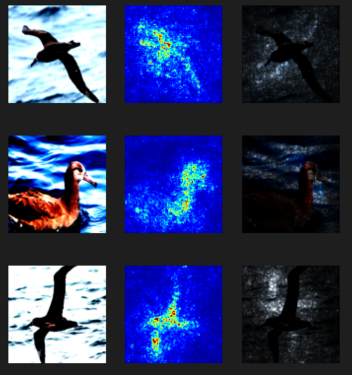
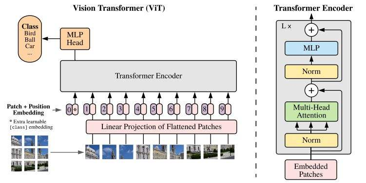
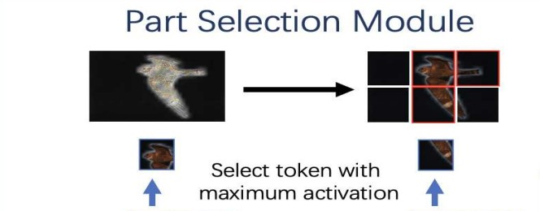
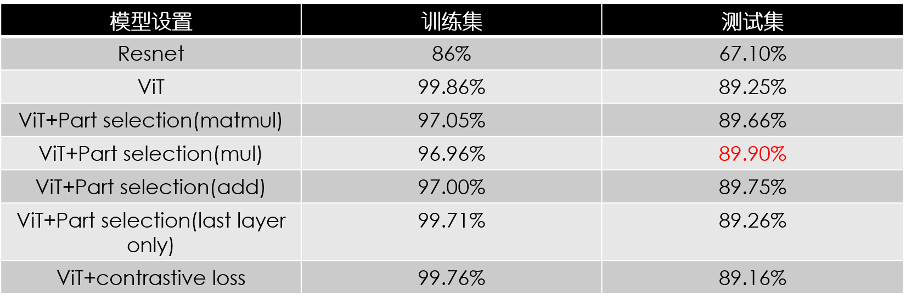

# AI编程大作业 作业文档
组员：曲悠然 李本厚 李文岳
## 1.使用CNN的对比实验

我们采用了在ImageNet上预训练的ResNet18[5]作为baseline,在该数据集上仅仅达到了不到70%的准确率。为此我们尝试了探究CNN在细粒度图像分类中的问题在哪里。

受FGSM[6]的启发，我们在训练好的模型上将图片输入，并得到图片的梯度。而后将三个通道的梯度绝对值相加我们便得到了每个像素对于模型的梯度。而梯度越大就意味着其扰动对于分类的影响越大，即对于模型分类越重要。从而我们便可以看到CNN的注意力在哪里。



如图，我们发现CNN可以大致捕捉到物体的位置，并将注意力投入，但非常粗糙同时对于细粒度图像分类来说并不足以捕捉真正细微的差别与特征。顺着该思路，我们想到了可以使用Self-Attention机制来捕捉这些重要的信息，因而我们的模型最终以ViT作为基石。

## 2.方法与模型
### 2.1 ViT


1.使用预处理模型ViT-B_16（https://storage.googleapis.com/vit_models/imagenet21k/ViT-B_16）[1]

2.对输入图像进行预处理，使用滑动窗口，生成重叠的patch，避免图像被分割成不重叠的小块。具体步骤：用分辨率H * W表示输入图像，图像patch的大小为P，滑动窗口的步长为s。这样，输入图像将被分割成N个补丁。这样，两个相邻斑块共享一个重叠的大小区域(P−S) * P，可以更好地保存局部区域信息。虽然增加了训练时间，但因为训练集很小，所以影响不大。根据我们电脑显存的情况将H和W设置为224。

```python
n_patches = ((img_size[0] - patch_size[0]) // config.slide_step + 1) * ((img_size[1] - patch_size[1]) // config.slide_step + 1)
self.patch_embeddings = Conv2d(in_channels=in_channels,
                               out_channels=config.hidden_size,
                               kernel_size=patch_size,
                               stride=(config.slide_step, config.slide_step))
```


3.使用传统的ViT的Patch Embedding 和 Transformer Encoder两个模块。[1]

将每个 patch $x_p^i$投影成一个可训练的D维空间向量，每一个向量都经过一个全连接层E，$x_p^iE$表示这个patch的patch embedding。

再添加一个可学习的position embedding $E_{pos}$,用来表示位置编码。

```python
self.position_embeddings=nn.Parameter(torch.zeros(1,n_patches+1,config.hidden_sieze))
```

用$z_0=[x_p^1E,x_p^2E,...,x_p^NE]+Epos$作为transformer encoder的初始输入

这里每一个XE都可以理解为一个token，类似自然语言中的单词标记。[2]

4.对于每个输入，让它经过多个MSA block包括多头自注意力、跳跃连接 (Add) 和层规范化 (Norm) 三个部分；然后在经过多个 MLP block包括前馈网络 (FFN)、跳跃连接 (Add) 和层规范化 (Norm) 三个部分。最后对它进行层规范化。[1]

```python
h = x
x = self.attention_norm(x)
x, weights = self.attn(x)
x = x + h

h = x
x = self.ffn_norm(x)
x = self.ffn(x)
x = x + h
return x, weights
```

这部分和vit也类似，不同点在于额外保存了weights用于之后的模块[3]

### 2.2 Part Selection Module



为了充分利用Transformer的attention机制，我们采用了Part selection mudule。显式的仅仅将self-attention中attention权重最大的patch的feature作为最后分类器的输入。这样我们可以确保分类器的分类依据是图片中信息量大、真正对分类起决定性作用的部分。

详细解释：第L-1层的输出原本是这样的：$Z_{L-1}=[Z^0_{L-1};Z^1_{L-1},...Z^N_{L-1}]$，前面某层的权重：$a_l=[a_l^0,a_l^1,a_l^2...a_l^K]$

如果有K个self-attention head,那么每个head里的权重是$a_l^i=[a_l^{i_0}...a_l^{i_N}]$[4]

最后将每个Layer中的attention采用矩阵乘、加、哈达玛乘等多种方式计算模型在全局尺度（分类用的token）上对于每个patch的attention，而后选取k个不同attention的最大值，将其对应的encoder中最后一层的hidden_state合在一起并展平，而后放入分类器。其中，全局attention计算方式作为超参数可供选择。

$Z=[Z_{L-1}^0...Z^{A_k}_{L-1}]$

```python
def forward(self, x):
        length = len(x)
        last_map = x[0]
        if self.fusion_way == 'add':
            for i in range(1, length):
                last_map = x[i] + last_map
        elif self.fusion_way == 'matmul':
            for i in range(1, length):
                last_map = torch.matmul(x[i], last_map)
        elif self.fusion_way == 'lastlayer':
            last_map = x[-1]
        else:
            for i in range(1, length):
                last_map = torch.mul(x[i], last_map)
        last_map = last_map[:,:,0,1:]
        _, max_inx = last_map.max(2)
        return _, max_inx
```


## 3.实验结果
我们的实验环境在Linux操作系统的服务器上（Featurize），使用了一张RTX3080；训练集测试集使用官方推荐的划分；数据增强上，采用了randomcrop与randomflip；图片尺寸为228*228；lr=1e-2同时配备cosine scheduler；batchsize=8；以下为实验结果：



如图，我们采用相同的超参数设定（如上），采用多种设定进行实验。ViT要显著的优于朴素的CNN架构，此外Part-selection-module对于模型的性能也有提升，其中每层attention的聚合方式设定为mul，即对位相乘效果最佳。同时我们也尝试了论文中提到的对比学习Loss[2],但实验发现其对于模型性能不利因而剔除该loss仅用交叉熵损失。

最终，我们模型的准确率达到了为 **89.90%** 的模型

## 4.总结
### 4.1 贡献
1：尝试直接使用CNN解决问题；并使用saliency map探究阐述CNN在该任务中的问题

2：针对上述问题，采用了有自注意力机制的ViT作为模型的backbone

3：在TransFG提出的part selection module的基础上提出新的对注意力聚合的方式并实验证明更加有效

4：去除了对准确率没有帮助的contrastive loss
### 4.2 讨论
1：在更高的算力条件下，使用更大的resize和batchsize会令准确率更好

2：针对不同layer的attention的聚合尚有其他手段，如low rank fusion等等

3：相较于直接应用ViT，加入part selection在Acc上提升非常有限，但可以减少约3%的训练时间

### 程序说明
必要信息均已包含在README.md中，如您在使用中有任何问题请通过邮箱或微信联系我们。我们可以提供我们训练使用的Featurize的账号，以及在该环境下可运行的示例。

### 参考文献

[1]:An Image Is Worth 16x16 Words: Transformers For Image Recognition At Scale (arXiv-2020)

[2]:TransFG: A Transformer Architecture for Fine-Grained Recognition (AAAI2022)

[3]:Attention is all you need (NIPS2017)

[4]:Is attention interpretable? (arXiv-2019)

[5]:Deep Residual Learning for Image Recognition (CVPR2016)

[6]:Explaining and harnessing adversarial examples (arXiv-2014)
### 小组分工

曲悠然：修改计算attention方式，进行实验，撰写作业文档以及PPT中的相关部分，撰写程序说明文档

李本厚：撰写除实验部分之外的作业文档

李文岳：制作除实验部分之外的PPT

